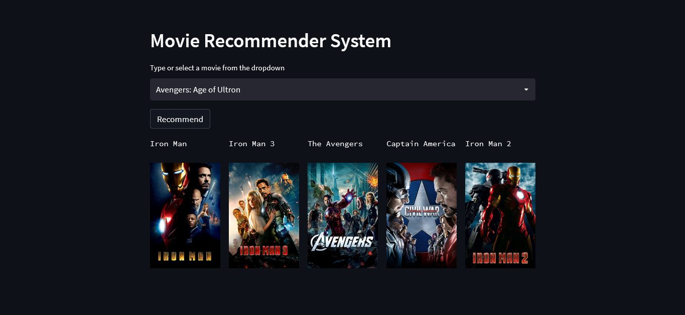
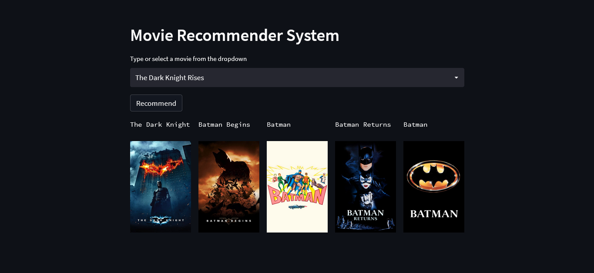
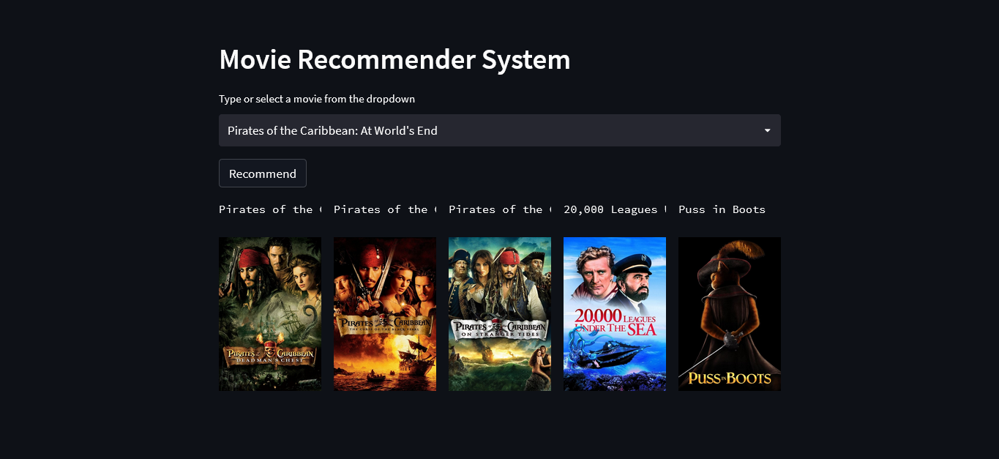

# Content based movie recommedation app


Content based movie recommedation app is used to recommend movies to the user using cosine similarity method.

## Installation
Open command prompt and create new environment
```
conda create -n your_env_name python=(any_version_number)
```
Then Activate the newly created environment
```
conda activate your_env_name
```
Clone the repository using `git`
```
git clone https://github.com/Prakashdeveloper03/Content-based-movie-recommedation-app.git
```
Change to the cloned directory
```
cd <directory_name>
```
Then install all requirement packages for the app
```
pip install -r requirements.txt
```
Then, Run the `app.py` script
```
streamlit run app.py
```
## 📷 Screenshots
### Avengers: Age of Ultron


### The Dark Knight Rises


### Pirates of the Caribbean: At World's End
